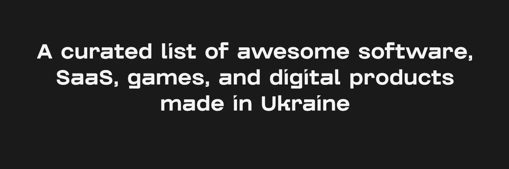

# Awesome Ukrainian Products 

> A curated list of awesome software, SaaS, games, and digital products made in Ukraine 🇺🇦 or by Ukrainian founders globally.

**[🇺🇦 Читати інструкцію українською](CONTRIBUTING.ua.md)**

This list aims to showcase the technological power and creativity of the Ukrainian IT sector. From world-famous unicorns to essential open-source utilities.

## Legend & Badges

To help navigate the list, we use the following badges to indicate the nature of the product:

| Badge | Meaning | Description |
| :--- | :--- | :--- |
|  | **Global Recognition** | Products known worldwide with a massive user base. |
|  | **Open Source** | Source code is available (GitHub/GitLab). |
|  | **Free** | Completely free to use. |
|  | **Freemium** | Free core features, paid upgrades available. |
|  | **Paid** | Requires purchase or subscription. |
|  | **Ukrainian Origins** | Founded by Ukrainians, currently HQ'd abroad (e.g., Silicon Valley). |

---

## Contents

- [Open Source & DevTools](#open-source--devtools)
- [Productivity & Utilities](#productivity--utilities)
- [SaaS & Business](#saas--business)
- [FinTech](#fintech)
- [AI & Deep Tech](#ai--deep-tech)
- [GameDev](#gamedev)
- [EdTech](#edtech)
- [Health & Lifestyle](#health--lifestyle)
- [Global Heritage](#global-heritage)
- [Related Resources](#-related-resources)

---

## Open Source & DevTools

- [Leaflet](https://leafletjs.com/) - The leading open-source JavaScript library for mobile-friendly interactive maps, created by Volodymyr Agafonkin.  
- [GitLab](https://about.gitlab.com/) - A complete DevOps platform delivered as a single application, co-founded by Dmytro Zaporozhets.  
- [Diia Open Source](https://github.com/diia-open-source) - The core logic of the Ukrainian "State in a Smartphone" application, released by the Ministry of Digital Transformation. 

## Productivity & Utilities

- [Grammarly](https://www.grammarly.com/) - An AI-powered writing assistant founded in Kyiv that helps millions communicate effectively.  
- [CleanMyMac](https://macpaw.com/cleanmymac) - An all-in-one cleanup and maintenance tool for macOS developed by MacPaw in Kyiv.  
- [Spark Mail](https://sparkmailapp.com/) - An intelligent email client by Readdle (Odesa) that helps manage inbox overload.  
- [Documents](https://readdle.com/documents) - A super app for file management on iOS, often referred to as the "Finder for iOS", by Readdle.  

## SaaS & Business

- [Ahrefs](https://ahrefs.com/) - An all-in-one SEO toolset founded by Dmytro Gerasymenko, widely used by marketing professionals globally.  
- [Restream](https://restream.io/) - A multi-streaming service founded in Vinnytsia that allows broadcasting to platforms like YouTube and Twitch simultaneously.  
- [People.ai](https://people.ai/) - An enterprise revenue intelligence platform that uses AI to automate data capture for sales teams.  
- [Jooble](https://jooble.org/) - One of the world's largest job aggregation engines, operating in over 70 countries.  
- [Depositphotos](https://depositphotos.com/) / [VistaCreate](https://create.vista.com/) - A major stock content marketplace and graphic design tool founded by Dmytro Sergeyev.  
- [3DLOOK](https://3dlook.me/) - A mobile body scanning technology for virtual try-on and precise body measuring in fashion retail. 

## FinTech

- [Monobank](https://www.monobank.ua/) - Ukraine's first mobile-only bank and a technological benchmark for global fintech UX, founded by Fintech Band. 
- [Revolut](https://www.revolut.com/) - A global financial superapp co-founded by Vlad Yatsenko (CTO).  

## AI & Deep Tech

- [Respeecher](https://www.respeecher.com/) - A voice cloning technology used in Hollywood (e.g., Star Wars) to replicate voices using deep learning. 
- [Reface](https://reface.ai/) - A synthetic media app for face-swapping in videos and GIFs that topped the US App Store.  
- [Petcube](https://petcube.com/) - Connected pet cameras and software that allow owners to watch and play with pets remotely.  

## GameDev

- [S.T.A.L.K.E.R. 2 / GSC Game World](https://www.stalker2.com/) - The creators of the legendary "Cossacks" and "S.T.A.L.K.E.R." series that defined Ukrainian game development.  
- [The Sinking City](https://frogwares.com/frogwares-games/) - An open-world investigation game inspired by H.P. Lovecraft, developed by Frogwares. 
- [Ostriv](https://ostrivgame.com/) - A city-building strategy game set in an 18th-century Ukrainian village, known for its unique organic layout mechanics. 
- [Level Zero: Extraction](https://store.steampowered.com/app/1456940/Level_Zero_Extraction/) - An asymmetric survival horror PvPvE game by Doghowl Games. 

## EdTech

- [Preply](https://preply.com/) - A global online language learning marketplace connecting tutors with students.  
- [Headway](https://makeheadway.com/) - A bite-sized learning app offering book summaries, frequently ranked #1 in the Education category globally.  

## Health & Lifestyle

- [BetterMe](https://betterme.world/) - A leading ecosystem of health and fitness apps promoting a holistic approach to well-being.  
- [Obimy](https://obimy.com/) - An emotional connection app that allows partners and friends to share feelings and "senses" digitally. 
- [Liki24](https://liki24.com/) - A health-tech platform for searching and delivering medicines, operating in Ukraine and the EU. 
- [Allset](https://www.allsetnow.com/) - A food ordering platform focusing on contactless dining and pickup, popular in the US.  

## Global Heritage

*Tech giants founded or co-founded by people born in Ukraine.*

- [WhatsApp](https://www.whatsapp.com/) - Co-founded by Jan Koum (born in Fastiv, Ukraine).  
- [PayPal](https://www.paypal.com/) / [Affirm](https://www.affirm.com/) - Co-founded by Max Levchin (born in Kyiv, Ukraine).  

---

## Related Resources

- [Made in Ukraine](https://github.com/chernivtsijs/made-in-ukraine) - An extensive collection focusing specifically on open-source libraries, packages, and frameworks (npm, pip, gem, etc.) developed by Ukrainians. Check this out to see the Ukrainian part of your `package.json`.

---

## License

